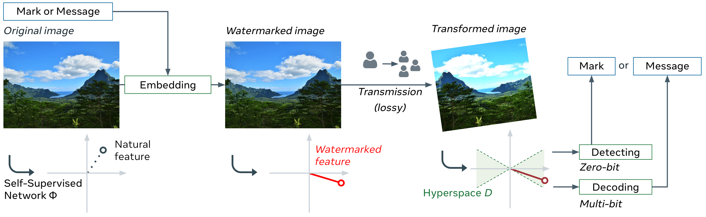

# :mag: Watermarking Images in Self-Supervised Latent-Spaces

PyTorch implementation and pretrained models for the paper.
For details, see [**Watermarking Images in Self-Supervised Latent-Spaces**](https://arxiv.org/abs/2112.09581).  

If you find this repository useful, please consider giving a star :star: and please cite as:

```
@inproceedings{fernandez2022sslwatermarking,
  title={Watermarking Images in Self-Supervised Latent Spaces},
  author={Fernandez, Pierre and Sablayrolles, Alexandre and Furon, Teddy and Jégou, Hervé and Douze, Matthijs},
  booktitle={IEEE International Conference on Acoustics, Speech and Signal Processing (ICASSP)},
  year={2022},
  organization={IEEE},
}
```

[[`Webpage`](https://pierrefdz.github.io/publications/sslwatermarking/)]
[[`arXiv`](https://arxiv.org/abs/2112.09581)] 
[[`Spaces`](https://huggingface.co/spaces/pierrefdz/ssl_watermarking)] 
[[`Colab`](https://colab.research.google.com/github/facebookresearch/ssl_watermarking/blob/master/notebooks/colab.ipynb)] 
[[`Video`](https://youtu.be/zgu0I8SQMdI)] 

## Introduction

<div align="center">
  
</div>

The method uses:
- a pretrained neural network and a normalization layer to extract features from images
- an embedding stage that invisibly changes the image to push the feature in certain directions of the latent space
- a decoding stage that detects or decode the mark that was added in the image


## Usage

First, clone the repository locally and move inside the folder:
```
git clone https://github.com/facebookresearch/ssl_watermarking.git
cd ssl_watermarking
```
Then, install the dependencies:
```
pip install -r requirements.txt
```
This codebase has been developed with python version 3.8, PyTorch version 1.10.2, CUDA 10.2 and torchvision 0.11.3.
The following considers `ssl_watermarking/` as the root folder, all paths are relative to it.

PS: [Trouble shooting for Augly](https://adobe-research.github.io/beacon-aug/trouble%20shooting.html)

## Images

You are free to use **your own images**.  
Images to be watermarked must be put in a folder of the form `<name/of/folder>/0/` for the dataloader to work. 
The image folder can be put on the `ssl_watermarking` folder, or in any other place, you will later need to specify the path to the folder by the argument `--data_dir <name/of/folder>`.  
We already provide 8 high-resolution-images in the `input` folder, from the [INRIA Holidays dataset](http://lear.inrialpes.fr/~jegou/data.php#holidays).

:warning: If images are too high resolution, an out-of-memory error might appear, you can try to resize your images beforehand.

### Batching

At the moment, batching only works if all images of the folder have the same size. For images with different sizes, please `--batch_size 1` argument.  
If your images have the same dimensions, batching greatly speeds up the process.

## Pretrained models & normalization layers <a name="model"></a>

To watermark, you need:
- a neural network model that extracts features from images.
- a normalization layer that transforms the features so that they are more evenly distributed in the latent space.

We provide the weights used in all of our experiments:

- Model: [ResNet-50 trained with DINO](https://dl.fbaipublicfiles.com/ssl_watermarking/dino_r50_plus.pth)
- Normalization layer, one of
  - [whitening](https://dl.fbaipublicfiles.com/ssl_watermarking/out2048_yfcc_orig.pth) (recommended)
  - [whitening for resized](https://dl.fbaipublicfiles.com/ssl_watermarking/out2048_yfcc_resized.pth) (recommended for low resolution images - around 128x128)
  - [whitening_v1](https://dl.fbaipublicfiles.com/ssl_watermarking/out2048_coco_orig.pth)
  - [whitening_v1 for resized](https://dl.fbaipublicfiles.com/ssl_watermarking/out2048_coco_resized.pth)

To use these weights, create the folders `models/` and `normlayers/` into the `ssl_watermarking` directory and put:
- `dino_r50_plus.pth` (weights of the backbone) in `models/`
- `out2048_yfcc_orig.pth` (weights of the normalization layer) in `normlayers/`.

The ResNet model was trained using https://github.com/pierrefdz/dino/ (same as original dino with an additional rotation augmentation). The arguments used to train the model are available [here](https://dl.fbaipublicfiles.com/ssl_watermarking/dino_r50_plus_args.txt).

The normalization layers that perform PCA whitening (see [wikipedia](https://en.wikipedia.org/wiki/Whitening_transformation)) are obtained over 100k images of YFCC for "whitening" (resp. COCO for "whitening v1") and of their version resized to 128x128.
If the input images have low resolution, we recommend using the normalization layer created from YFCC resized, otherwise, we recommend using the one created from the original sizes.


## Watermarking

### :zero: 0-bit

*To perform 0-bit watermarking*:
```
python main_0bit.py --data_dir <path/to/imgs> \
  --model_path <path/to/model> --normlayer_path <path/to/normlayer> \
  --target_psnr <PSNR> --target_fpr <FPR>
```

For instance, running:
```
python main_0bit.py --data_dir <path/to/yfcc1k> --model_path models/dino_r50_plus.pth --normlayer_path normlayers/out2048_yfcc_orig.pth --batch_size 1 --target_psnr 40 --target_fpr 1e-6
```
gives the following [logs](https://dl.fbaipublicfiles.com/ssl_watermarking/logs_0bit.txt) and [`output/df_agg.csv`](https://dl.fbaipublicfiles.com/ssl_watermarking/df_agg_0bit.csv) (see [evaluation](#eval) for details on the csv files).

*To run detection only*:
```
python main_0bit.py --decode_only True --data_dir <path/to/imgs> \
  --model_path <path/to/model> --normlayer_path <path/to/normlayer> \
  --target_fpr <FPR>
```
You should obtain a file in the `output` folder, such as [`decodings.csv`](https://dl.fbaipublicfiles.com/ssl_watermarking/decodings_0bit.csv):

| index|Marked|filename|
|:---|:---|---|
| 0|True|0_out.png|
| 1|True|1_out.png|
| 2|True|2_out.png|

### :1234: Multi-bit watermarking

*To perform multi-bit watermarking (hide K bits in the image)*:
```
python main_multibit.py --data_dir <path/to/imgs> \
  --model_path <path/to/model> --normlayer_path <path/to/normlayer> \
  --target_psnr <PSNR> --num_bits <K>
```

For instance, running:
```
python main_multibit.py --data_dir <path/to/coco1k_resized> --model_path models/dino_r50_plus.pth --normlayer_path normlayers/out2048_coco_resized.pth --batch_size 128 --target_psnr 33 --num_bits 30
```
gives the following [logs](https://dl.fbaipublicfiles.com/ssl_watermarking/logs_multibit.txt) and [`output/df_agg.csv`](https://dl.fbaipublicfiles.com/ssl_watermarking/df_agg_multibit.csv) (see [evaluation](#eval) for details on the csv files).

To run decoding only:
```
python main_multibit.py --decode_only True --data_dir <path/to/imgs> \
  --model_path <path/to/model> --normlayer_path <path/to/normlayer> \
  --num_bits <K>
```

You should obtain a file in the `output` folder, such as [`decodings.csv`](https://dl.fbaipublicfiles.com/ssl_watermarking/decodings_multibit.csv):

| index|msg|:filename|
|:---|:---|---|
| 0|000010010101100101101111110101|0_out.png|
| 1|011000101001001010000100111000|1_out.png|
| 2|100001100010111010111100011000|2_out.png|

#### :pencil: *With your own messages*

You can alternatively decide to use your own messages.
Create a folder `messages/` in `ssl_watermarking` and put a file called `msgs.txt` in it. 
The kth line of the message should be the message you want to hide in the kth image (if there are more images than messages, messages are repeated cyclically).
It can be:
- a text (e.g. "Hello world!"): put `--msg_type text` argument for `main_multibit.py`.  
  The text messages are encoded using 8-bits characters, i.e. the first 256 characters, from [Unicode UTF-8](https://www.charset.org/utf-8) (be careful when using special characters such as :mag:).  
  If messages don't have same length, they are padded with white space. 
- a list of bits (e.g. "0010110011"): put `--msg_type bit` argument for `main_multibit.py` 

Examples: [text](https://dl.fbaipublicfiles.com/ssl_watermarking/msgs_text.txt), [bits](https://dl.fbaipublicfiles.com/ssl_watermarking/msgs_bits.txt). Then, append the argument `--msg_path <path/to/msgs.txt> --msg_type <type>` to the previous command line.

:warning: If the `--num_bit <K>` argument (Default: 30) doesn't match the length of the messages computed from `msgs.txt`, say 56, the `num_bits` argument will be automatically set to 56. A warning will appear. To get rid of it, you just need to append `--num_bit 56` to the previous command line.

### :chart_with_upwards_trend: Evaluation <a name="eval"></a>

The previous commands should return the score of the detection on several attacks and store them in `output/agg_df.csv` and `output/df.csv`. 
- `output/agg_df.csv` gives general metrics for the decoding on several attacks. Ex: R, p-value, Bit accuracy, etc.

  Reduced example for 0-bit watermarking:

  |||log10_pvalue||||R||||marked||||
  |---|---|---|---|---|---|---|---|---|---|---|---|---|---|
  |||mean|min|max|std|mean|min|max|std|mean|min|max|std|
  |attack     |param0|      |       |       |       |         |         |       |       |     |       |     |     |
  |blur       |11.0 |-40.7  |-81.3  |-0.13  |14.23  | 1.53e6  |-3.19e5  |7.00e6 |1.10e6 |0.99 |False  |True |0.09 |
  |center_crop|0.5  |-21.46 |-64.65 |-0.14  |9.17   | 6.89e5  |-3.73e5  |3.89e6 |6.42e5 |0.96 |False  |True |0.18 |
  |rotation   |25.0 |-26.29 |-66.08 |-0.02  |10.95  | 5.87e5  |-3.77e5  |3.80e6 |5.47e5 |0.97 |False  |True |0.14 |

  (where, R is the acceptance function that determines "how much" the feature lies in the cone, and the p-value is such that if we were drawing O(1/pvalue) random carriers, on expectation, one of them would give an R bigger or equal to the one that is observed.)

- `output/df.csv` gives metrics for each image. Ex: detected or not, message, etc.

  Reduced example for 0-bit watermarking:

  |img|attack|log10_pvalue|R|marked|param0|
  |---|---|---|---|---|---|
  |0|none       |-67.87 |5.80e6|True|-1.0|
  |0|meme_format|-29.60 |4.49e5|True|-1.0|
  |0|rotation   |-28.56 |4.70e5|True|35.0|
  |1|none       |-76.12 |2.68e6|True|-1.0|
  |1|meme_format|-21.17 |1.73e5|True|-1.0|
  |1|rotation   |-12.29 |1.23e5|True|35.0|


You can deactivate the evaluation by setting `--evaluate False`.

### :floppy_disk: Saving images

The previous scripts store the attacked versions of the first image (of the folder of images to be watermarked) when evaluating on different attacks. 
They also save all watermarked images.
The images are stored in `output/imgs/`.

You can choose not to save the images by setting `--save False`.


## Data Augmentation

By default, the optimization is done for the watermark to be robust on different augmentations (crop, resize, blur, rotation, etc.). 
If you are not interested in robustness, you choose to set `--data_augmentation None`. You can then drastically reduce the number of epochs in the optimization: typically `--epochs 10` should already give good results.

If you are interested in robustness to specific transformations, you can either:
- change the default parameters used in the class `All()` of `data_augmentation.py`.
- create a new data augmentation that inherits the `DifferentiableDataAugmentation` class. The main restriction is that the augmentation should be differentiable.

## Using other architectures

Although we highly recommend using the resnet50 architecture with the given weights, other models from the [torchvision](https://pytorch.org/vision/stable/models.html) of [timm](https://rwightman.github.io/pytorch-image-models/models/) library can also be used. 
In this case, you can either not put any normalization layer (not recommended - gives far worse performance) or create a new normalization layer. To do so, please run:
```
python build_normalization_layer.py --model_name <model_name> --model_path <path/to/model/> --large_data_dir <path/to/big/dataset/for/PCA/whitening> 
```
You can improve the whitening step by using a dataset that has similar distribution to the images you want to watermark and a number of images in the order of 10K. You can also change the parameters of the resize crop transform (with the `img_size` and `crop_size` arguments) that is used before feature extraction to have images resized as little as possible. 

## Reproduce paper results

The paper uses images from [CLIC](http://clic.compression.cc/2018/challenge/), Multimedia Commons [YFCC100M](http://www.multimediacommons.org/) and [COCO](https://cocodataset.org/) datasets. 
You will need to download them and extract 1k images from them (except CLIC that has less images) to reproduce results from the paper.

You also need to download the model and normalization layer weights (see [Pretrained models & normalization layers](#model)).

Remark: The overlay onto screenshot transform (from Augly) that is used in the paper is the mobile version (Augly's default: web). To change it, you need to locate the file `augly/utils/base_paths.py` (run `pip show augly` to locate the Augly library). Then change the line "TEMPLATE_PATH = os.path.join(SCREENSHOT_TEMPLATES_DIR, "web.png")" to "TEMPLATE_PATH = os.path.join(SCREENSHOT_TEMPLATES_DIR, "mobile.png")".

### Table 1: TPR for 0-bit watermarking
You will need to run:
```
python main_0bit.py --data_dir <path/to/yfcc1k> --model_path models/dino_r50_plus.pth --normlayer_path normlayers/out2048_yfcc_orig.pth --batch_size 1 --target_psnr 40 --target_fpr 1e-6 --output_dir output_ssl/
```

To compare with the supervised model, you need to download the [supervised model weights](https://dl.fbaipublicfiles.com/ssl_watermarking/r50_90.pth.tar) (trained with a [fork](https://github.com/pierrefdz/train-nn) of the torchvision code, with additional rotation augmentation), and [whitening layer weights](https://dl.fbaipublicfiles.com/ssl_watermarking/out2048_yfcc_orig_sup.pth) and put them in the `models` (resp. the `normlayers`) folder. Then run:
```
python main_0bit.py --data_dir <path/to/yfcc1k> --model_path models/r50_90.pth.tar --normlayer_path normlayers/out2048_yfcc_orig_sup.pth --batch_size 1 --target_psnr 40 --target_fpr 1e-6 --output_dir output_sup/
```

### Table 2: BER & WER for multi-bit watermarking
You will need to run:
```
python main_multibit.py --data_dir <path/to/yfcc1k> --model_path models/dino_r50_plus.pth --normlayer_path normlayers/out2048_yfcc_orig.pth --batch_size 1 --target_psnr 40 --num_bits 30
```

### Table 3: BER for multi-bit watermarking on COCO resized to (128x128)
You will need to run:
```
python main_multibit.py --data_dir <path/to/coco1k_resized> --model_path models/dino_r50_plus.pth --normlayer_path normlayers/out2048_coco_resized.pth --batch_size 128 --target_psnr 33 --num_bits 30
```


## License

ssl_watermarking is CC-BY-NC licensed, as found in the LICENSE file.
